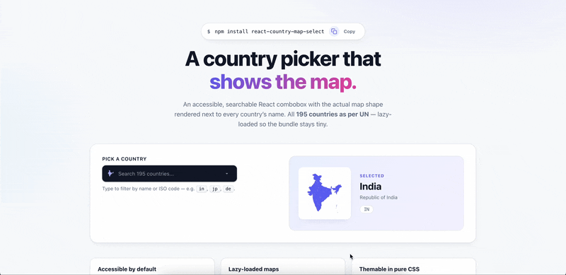

# react-country-map-select

[](https://www.npmjs.com/package/react-country-map-select)
[](https://bundlephobia.com/package/react-country-map-select)
[](https://bundlephobia.com/package/react-country-map-select)
[](https://www.npmjs.com/package/react-country-map-select)
[](./LICENSE)

<p align="center">
  
</p>

An accessible React dropdown for picking a country, with each option showing the country's actual map shape next to its name.

- Searchable combobox (keyboard-friendly, ARIA-correct via [downshift](https://github.com/downshift-js/downshift))
- 195 sovereign country map SVGs included (193 UN member states + 2 observers)
- Each map is **lazy-loaded** &mdash; the initial bundle stays small
- Full TypeScript types: `CountryCode` is a literal union, so `defaultValue="in"` autocompletes
- Themable via plain CSS custom properties &mdash; no CSS-in-JS runtime

## Install

```bash
npm install react-country-map-select
# or
pnpm add react-country-map-select
```

`react` and `react-dom` are peer dependencies.

## Usage

```tsx
import { useState } from "react";
import { CountryMapSelect, type CountryCode } from "react-country-map-select";
import "react-country-map-select/styles.css";

export function CountryField() {
  const [code, setCode] = useState<CountryCode | null>("in");
  return (
    <CountryMapSelect
      ariaLabel="Country"
      value={code}
      onChange={(next) => setCode(next)}
      placeholder="Select a country"
    />
  );
}
```

### Render a single map (no dropdown)

```tsx
import { CountryMap } from "react-country-map-select";

<CountryMap code="in" size={48} title="Map of India" />;
```

`<CountryMap>` lazy-loads the country chunk on first render. For SSR or non-Suspense renderers, import the static eager components from the `/maps` subpath:

```tsx
import { IN } from "react-country-map-select/maps";

<IN width={48} height={48} />;
```

## Props

### `<CountryMapSelect>`

| Prop             | Type                            | Default              | Description                         |
| ---------------- | ------------------------------- | -------------------- | ----------------------------------- |
| `value`          | `CountryCode \| null`           | &mdash;              | Controlled selected code            |
| `defaultValue`   | `CountryCode \| null`           | `null`               | Initial selection (uncontrolled)    |
| `onChange`       | `(code, country) => void`       | &mdash;              | Fires when the user picks a country |
| `countries`      | `CountryCode[]`                 | all 195              | Whitelist of codes to show          |
| `exclude`        | `CountryCode[]`                 | `[]`                 | Codes to remove from the list       |
| `searchable`     | `boolean`                       | `true`               | Show a typeahead filter             |
| `placeholder`    | `string`                        | `'Select a country'` | Trigger / search placeholder        |
| `getOptionLabel` | `(country) => string`           | name                 | Override option label (i18n hook)   |
| `renderOption`   | `(country, state) => ReactNode` | &mdash;              | Replace default option rendering    |
| `mapSize`        | `number`                        | `20`                 | Pixel size of inline map icons      |
| `disabled`       | `boolean`                       | `false`              | Disable the entire component        |
| `id`             | `string`                        | &mdash;              | id applied to the input             |
| `ariaLabel`      | `string`                        | &mdash;              | Accessible name                     |
| `className`      | `string`                        | &mdash;              | Class on the root wrapper           |
| `style`          | `CSSProperties`                 | &mdash;              | Inline style on the root wrapper    |
| `menuMaxHeight`  | `number`                        | `320`                | Max height of the open menu (px)    |

### `<CountryMap>`

Accepts every standard `<svg>` prop, plus:

| Prop    | Type               | Default | Description                                                   |
| ------- | ------------------ | ------- | ------------------------------------------------------------- |
| `code`  | `CountryCode`      | &mdash; | Which country to render                                       |
| `size`  | `number \| string` | `20`    | Sets both width and height                                    |
| `title` | `string`           | &mdash; | Accessible label; if omitted the SVG is treated as decorative |

## Theming

All visuals are controlled by CSS custom properties on `.rcms-root`. Override them at any level &mdash; a parent, a wrapper, or per-instance via `style` / `className`.

### Light mode (defaults)

| Variable                | Default                    | Purpose                                   |
| ----------------------- | -------------------------- | ----------------------------------------- |
| `--rcms-bg`             | `#ffffff`                  | Background of trigger & menu              |
| `--rcms-bg-hover`       | `#f9fafb`                  | Background on hover (toggle button)       |
| `--rcms-bg-highlighted` | `#eef2ff`                  | Background of keyboard-highlighted option |
| `--rcms-bg-selected`    | `#e0e7ff`                  | Background of currently selected option   |
| `--rcms-fg`             | `#0f172a`                  | Primary text color                        |
| `--rcms-fg-muted`       | `#64748b`                  | Placeholder & secondary text              |
| `--rcms-border`         | `#e5e7eb`                  | Trigger & menu border                     |
| `--rcms-border-hover`   | `#d1d5db`                  | Trigger border on hover                   |
| `--rcms-border-focus`   | `#6366f1`                  | Trigger border when focused               |
| `--rcms-ring`           | `rgba(99, 102, 241, 0.18)` | Focus ring color                          |
| `--rcms-radius`         | `10px`                     | Corner radius                             |
| `--rcms-map-color`      | `#6366f1`                  | Map SVG fill (uses `currentColor`)        |
| `--rcms-row-gap`        | `0.625rem`                 | Gap between map and label                 |
| `--rcms-trigger-height` | `44px`                     | Min-height of the trigger                 |
| `--rcms-shadow`         | (subtle)                   | Shadow on the trigger                     |
| `--rcms-shadow-menu`    | (medium)                   | Shadow on the open menu                   |

### Dark mode

Dark theme kicks in automatically via `@media (prefers-color-scheme: dark)`. To force it for a specific subtree, scope your own override:

```css
.my-app[data-theme="dark"] .rcms-root {
  --rcms-bg: #0f172a;
  --rcms-fg: #f1f5f9;
  --rcms-border: #1f2937;
  --rcms-border-focus: #818cf8;
  --rcms-bg-hover: #1e293b;
  --rcms-bg-highlighted: #1e293b;
  --rcms-bg-selected: #312e81;
  --rcms-fg-muted: #94a3b8;
  --rcms-map-color: #a5b4fc;
  --rcms-ring: rgba(129, 140, 248, 0.22);
}
```

### Example: brand colors

```css
.rcms-root {
  --rcms-border-focus: #f97316;
  --rcms-ring: rgba(249, 115, 22, 0.22);
  --rcms-bg-highlighted: #fff7ed;
  --rcms-bg-selected: #ffedd5;
  --rcms-map-color: #f97316;
  --rcms-radius: 16px;
}
```

### Example: per-instance override

```tsx
<CountryMapSelect
  ariaLabel="Country"
  style={{
    // Cast as any to allow CSS custom property keys
    ["--rcms-border-focus" as any]: "#10B981",
    ["--rcms-ring" as any]: "rgba(16, 185, 129, 0.22)",
  }}
/>
```

### Reduced motion

The package automatically disables animations under `@media (prefers-reduced-motion: reduce)` &mdash; no opt-in needed.

### Overriding class names

Every visible element has a stable BEM-style class you can target directly if CSS variables aren't enough:

| Class                       | Element                                    |
| --------------------------- | ------------------------------------------ |
| `.rcms-root`                | Outer wrapper                              |
| `.rcms-trigger`             | Trigger row (map + input + caret)          |
| `.rcms-trigger-map`         | Selected country's map icon in the trigger |
| `.rcms-input`               | Search / typeahead input                   |
| `.rcms-toggle`              | Caret button                               |
| `.rcms-menu`                | Open dropdown listbox                      |
| `.rcms-option`              | Single option row                          |
| `.rcms-option--highlighted` | Option under keyboard highlight            |
| `.rcms-option--selected`    | Currently selected option                  |
| `.rcms-option-map`          | Option's map icon                          |
| `.rcms-option-label`        | Option's text label                        |
| `.rcms-empty`               | "No matches" row                           |
| `.rcms-map-skeleton`        | Loading placeholder for lazy-loaded maps   |

## Accessibility

- The trigger is an `role="combobox"` with proper `aria-expanded`, `aria-controls`, and `aria-activedescendant` (via downshift).
- The menu is `role="listbox"` with `role="option"` items.
- Keyboard: `Arrow Up`/`Arrow Down` to move highlight, `Home`/`End` to jump, `Enter` to select, `Esc` to close, type to filter.
- Maps are decorative (`aria-hidden`) inside the dropdown so screen readers announce only the country name.

## SSR &amp; Next.js

`<CountryMap>` and `<CountryMapSelect>` use `React.lazy` + `Suspense`, which works in Next.js&rsquo; app router out of the box. For the pages router or other non-streaming renderers, use the static map components directly:

```tsx
import { IN, US, GB } from "react-country-map-select/maps";
```

## Bundle size

|                             | Gzipped                                      |
| --------------------------- | -------------------------------------------- |
| Main entry (no maps loaded) | ~9 KB                                        |
| Median country chunk        | ~10 KB                                       |
| Largest country chunk       | ~170 KB _(highly detailed admin boundaries)_ |

Each country&rsquo;s map is its own chunk &mdash; consumers only download the maps they actually render.

## Country coverage

The package ships with **195 sovereign nations** &mdash; all 193 UN member states plus the 2 UN observer states (Holy See / Vatican City and Palestine). Dependent territories and disputed regions are intentionally excluded so consumers always get a clean, internationally recognized list. Use the `countries` (whitelist) and `exclude` (blacklist) props to scope further if you only need a subset.

## Map data attribution

Country map shapes are sourced from [simplemaps.com](https://simplemaps.com) under their free-for-commercial-use license. See [LICENSE-DATA.md](./LICENSE-DATA.md) for the notice.

## License

[MIT](./LICENSE) for the source code. Map data is licensed separately by simplemaps.com.
